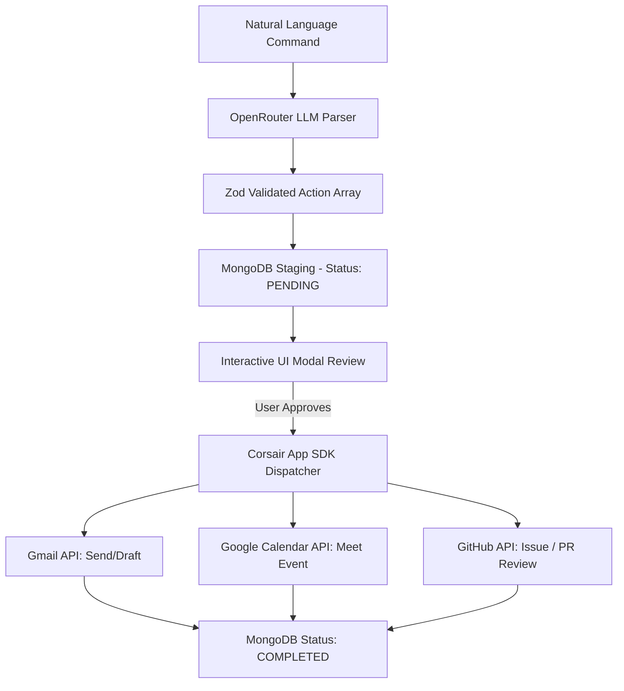
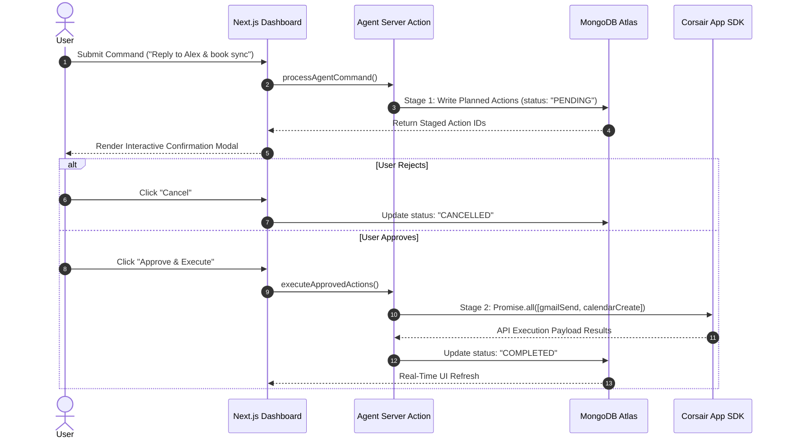

# API Integrations & Safety Architecture

Auren acts as an intelligent, automated execution layer between natural language developer intent and third-party software workflows. Rather than maintaining custom, brittle API wrappers for every individual vendor, Auren leverages the **Corsair App SDK** as a unified integration gateway for Google Workspace (Gmail, Google Calendar) and GitHub.

This document details how integration actions are registered, authenticated, safely gated through human oversight, and executed concurrently.

---

## 🔌 Corsair App SDK Integration Engine

The Corsair App SDK unifies multi-service authentication, request formatting, and payload normalization into a standard tenant-aware client.



### Supported Integration Actions

| Provider | Tool Key | Method Signature / Parameters | Primary Execution Outcome |
| :--- | :--- | :--- | :--- |
| **Gmail** | `gmail_send` | `toEmail`, `subject`, `bodyText` | Dispatches outbound emails via user's connected Gmail OAuth account |
| **Gmail** | `gmail_read` | `maxResults`, `folderType` | Fetches live inbox messages for contextual planning |
| **Google Calendar** | `calendar_create` | `summary`, `startTime`, `endTime`, `attendees` | Schedules events and automatically attaches Google Meet links |
| **Google Calendar** | `calendar_list` | `timeMin`, `timeMax` | Retrieves scheduled events for conflict checking |
| **GitHub** | `github_issue` | `repo`, `title`, `body` | Opens structured issues in target repository |
| **GitHub** | `github_review_pr` | `repo`, `pullNumber`, `event`, `body` | Submits pull request review comments and approvals |

---

## 🔒 Human-in-the-Loop (HITL) Safety State Machine

Automated AI agents operating on personal workspace data can introduce destructive side effects if left unconstrained (such as sending hallucinated email drafts or creating duplicate issues). Auren eliminates this risk by enforcing a strict **2-Stage State Machine**.

> [!IMPORTANT]
> **Zero Unverified API Side-Effects:** No external write or mutation API call is ever dispatched during Stage 1. Actions remain isolated in the staging database until explicitly confirmed by the user.



### Stage 1: Staging & Inspection
1. The user's prompt is parsed into structured `PlannedAction[]` payloads validated by Zod schemas.
2. Actions are recorded in the `agent_actions` MongoDB collection with a `PENDING` state.
3. The UI presents an interactive confirmation modal displaying exact field inputs (e.g., target email, meeting times, issue details).

### Stage 2: Parallel Execution
1. Upon explicit user confirmation, server actions trigger parallel dispatch calls via `Promise.all()`.
2. Corsair App SDK dispatches requests concurrently to third-party endpoints.
3. Upon receiving response payloads, action states transition to `COMPLETED` (or `FAILED` with captured error diagnostics) in the database audit log.

---

## 📩 Gmail Real-Time Webhook Classification

To provide real-time inbox intelligence without polling, Auren processes incoming Gmail push notifications asynchronously.

```
[ Gmail Push Event ] ──► [ POST /api/webhooks/gmail ] ──► [ HMAC Verification ]
                                                                   │
                                                                   ▼
[ MongoDB Storage ] ◄── [ Priority Labeling ] ◄── [ Claude Haiku Classification ]
```

1. **Webhook Ingestion:** Gmail sends real-time push events to `/api/webhooks/gmail`.
2. **Cryptographic Validation:** Headers are checked against secret HMAC signatures to prevent spoofing or unauthorized payload injection.
3. **Sub-200ms Priority Classification:** Message snippets are evaluated by Claude Haiku and categorized into priority tiers:
   - `URGENT`: Requires immediate attention or user response.
   - `NORMAL`: Standard operational or transactional emails.
   - `FYI`: Automated system updates, newsletters, or low-priority notifications.
4. **Persistence:** Categorized messages and contact details are stored in MongoDB (`emails` and `contacts` collections) for instant semantic context retrieval.

---

## 🔑 Multi-Tenant Security & Tenant Binding

Every request made through the Corsair App SDK is bound strictly to the authenticated user's workspace tenant:

```typescript
// src/lib/corsair.ts
export async function getTenant() {
  const devKey = process.env.CORSAIR_DEV_KEY;
  const instanceId = process.env.CORSAIR_INSTANCE_ID;
  const tenantId = await getUserId(); // SHA-1 deterministic UUID from Clerk auth

  if (!devKey || !instanceId || !tenantId) {
    throw new Error("Missing Corsair environment variables");
  }

  const app = createApp({ apiKey: devKey });
  return app.instance(instanceId).tenant(tenantId);
}
```

> [!NOTE]
> Combining deterministic user hashing with Corsair tenant binding guarantees that user OAuth tokens and API operations remain completely isolated across multi-tenant environments.
