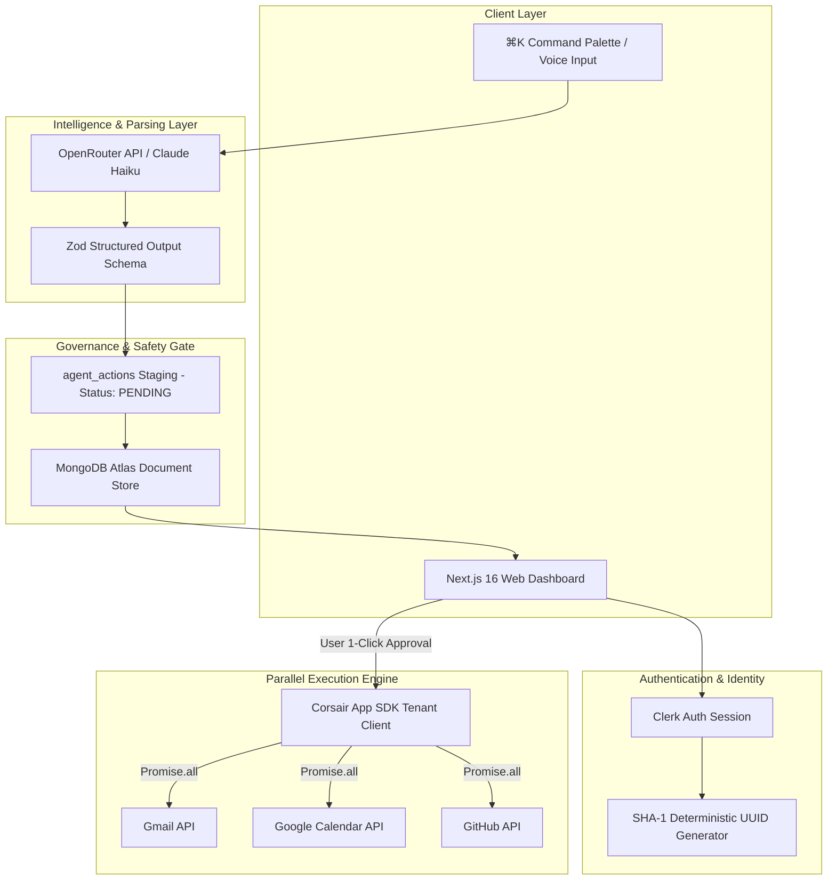

# System Architecture & Execution Lifecycle

Auren is an intelligent command center and automated execution engine for **Gmail**, **Google Calendar**, and **GitHub**. It converts single natural-language user prompts into multi-tool execution plans, allowing users to review, edit, and run complex multi-service workflows simultaneously with a single click.

---

## 🏗️ High-Level System Architecture

Auren is built on Next.js 16 App Router, using Clerk for authentication, MongoDB Atlas for state persistence, OpenRouter / Claude Haiku for intent parsing, and the Corsair App SDK for third-party API dispatches.



---

## 🔄 Step-by-Step Execution Lifecycle

### 1. User Ingestion & Multi-Tenant Identity Isolation
- User submits a command via the Next.js interactive web dashboard or the ⌘K command palette.
- Clerk authenticates the session and provides a user string identifier (e.g., `user_2x...`).
- `getUserId()` hashes the raw Clerk ID into a canonical SHA-1 32-character hex UUID format (`xxxxxxxx-xxxx-xxxx-xxxx-xxxxxxxxxxxx`).
- This guarantees strict multi-tenant data isolation and index performance across MongoDB database queries.

```typescript
// src/lib/user.ts
export async function getUserId(): Promise<string> {
  const { userId } = await auth();
  if (!userId) throw new Error("Unauthorized");

  const hash = createHash("sha1").update(userId).digest("hex");
  return `${hash.slice(0, 8)}-${hash.slice(8, 12)}-${hash.slice(12, 16)}-${hash.slice(16, 20)}-${hash.slice(20, 32)}`;
}
```

### 2. Workspace Context Assembly & Intent Parsing
- `processAgentCommand` gathers recent workspace context, such as unread emails and upcoming calendar events.
- Prompt payload and context are submitted to OpenRouter (routing to Claude Haiku or GPT-4o).
- The LLM output is strictly validated against Zod JSON schemas, producing a strongly typed `PlannedAction[]` array.

### 3. Human-in-the-Loop Governance Gate (Stage 1)
- Proposed actions are written to MongoDB (`agent_actions` collection) with a status of `PENDING`.
- **Zero external APIs are called during this phase.**
- The UI presents an interactive confirmation modal showing exact action parameters (recipient emails, meeting schedules, GitHub issue text) for user review and editing.

### 4. Parallel Multi-Tool Execution (Stage 2)
- When the user clicks **Approve & Execute**, Next.js Server Actions initiate concurrent API dispatches via `Promise.all()`.
- Operations execute simultaneously rather than sequentially:
  - **Gmail:** Dispatches email responses or drafts.
  - **Google Calendar:** Creates events and generates Google Meet video links.
  - **GitHub:** Opens repository issues or submits PR reviews.
- Upon completion, action statuses transition to `COMPLETED` and results are logged to the audit trail.

### 5. Asynchronous Webhooks & Intelligent Inbox Ingestion
- Real-time Gmail webhooks land at `/api/webhooks/gmail`.
- Secret HMAC headers are validated to verify request authenticity.
- Incoming messages are classified asynchronously by Claude Haiku in under 200ms into `URGENT`, `NORMAL`, or `FYI` priority buckets, updating MongoDB collections (`emails`, `contacts`).

---

## 🛡️ Architectural Resilience & Design Guarantees

> [!NOTE]
> **Fail-Open Database Connectivity:** The MongoDB helper (`src/lib/db.ts`) catches connection errors gracefully and fails open, allowing UI components to remain operational even during temporary database latency spikes.

- **Deterministic Tenant Isolation:** SHA-1 user identity hashing enforces separation across database collections and Corsair tenant instances.
- **Strict Rate Limiting:** Request velocity limits protect against API abuse and accidental LLM loop execution (`src/lib/rate-limit.ts`).
- **Complete Audit Trail:** Every action planned, approved, or executed is persisted with timestamps, parameters, and execution status for full operational transparency.
