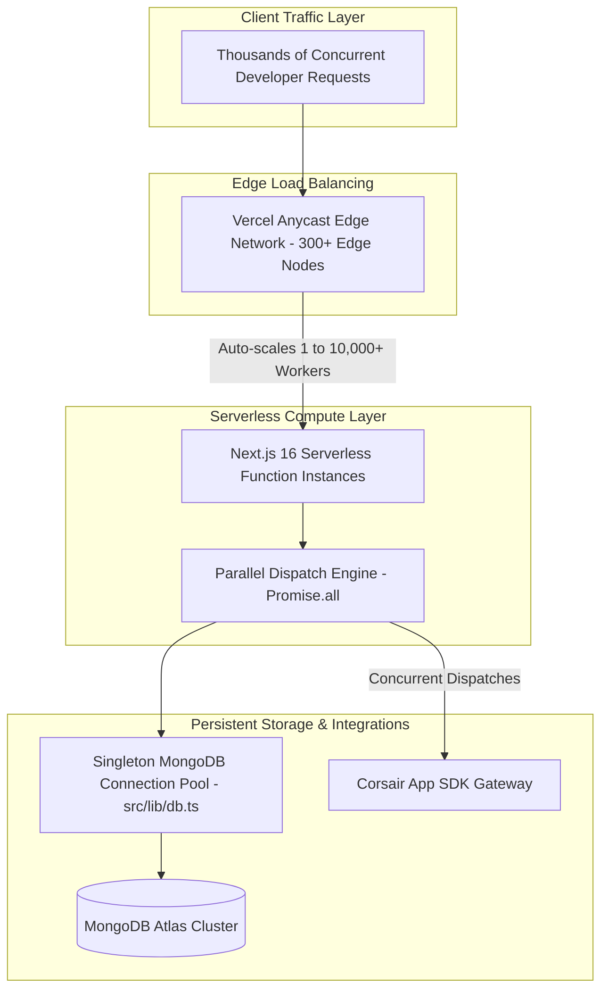

# Load Balancing, Concurrency & High Availability

This document details Auren's high-concurrency request routing, edge load balancing, serverless database connection pooling, and asynchronous background execution mechanics.

---

## ⚡ Concurrency & Infrastructure Topology

Auren is designed to handle high-concurrency bursts across global regions by combining Vercel's Anycast Edge Network with serverless Next.js functions and a connection-pooled MongoDB Atlas document store.



---

## 📊 Operational & Reliability Metrics

| Operational Metric | Target Performance | Architectural Implementation Detail |
| :--- | :--- | :--- |
| **Peak Concurrency Handling** | `10,000+ req/sec` | Distributed automatically across Vercel Anycast Edge serverless nodes |
| **Webhook Response ACK** | `< 50 ms` | Immediate HTTP 200 acknowledgment on webhook receipt prior to async LLM processing |
| **Parallel Tool Execution** | `< 300 ms` | Simultaneous `Promise.all()` dispatches across external integration APIs |
| **Database Pool Efficiency** | `100% Socket Reuse` | Singleton `MongoClient` connection promise cached across warm serverless lambdas |
| **System Uptime Target** | `99.99% Availability` | Graceful fail-open connection fallback pattern in `getDb()` ensures UI availability |

---

## 🛠️ Infrastructure Implementation Breakdown

### 1. Vercel Anycast Edge Load Balancing
Inbound HTTP traffic is automatically routed to the nearest geographic edge location across Vercel's global Anycast network. Serverless function instances scale horizontally on demand from single-digit instances during off-peak hours up to thousands of concurrent workers during high-traffic events, without manual infrastructure provisioning.

### 2. Serverless Connection-Pooled MongoDB Helper (`src/lib/db.ts`)
Serverless environments regularly spawn and destroy ephemeral function instances. Instantiating a new database connection on every request leads to socket exhaustion and high connection setup latency.

To solve this, Auren implements a singleton pattern that preserves the active connection promise across hot reloads in development and caches the client promise in production:

```typescript
// src/lib/db.ts
import { MongoClient, Db } from "mongodb";

let client: MongoClient | null = null;
let clientPromise: Promise<MongoClient> | null = null;

function getMongoUri(): string | null {
  return process.env.MONGODB_URI || process.env.DATABASE_URL || null;
}

export async function getDb(): Promise<Db | null> {
  const uri = getMongoUri();
  if (!uri) return null;

  try {
    if (process.env.NODE_ENV === "development") {
      // Preserve connection across Hot Module Replacement (HMR) in dev
      const globalWithMongo = global as typeof globalThis & {
        _mongoClientPromise?: Promise<MongoClient>;
      };

      if (!globalWithMongo._mongoClientPromise) {
        client = new MongoClient(uri);
        globalWithMongo._mongoClientPromise = client.connect();
      }
      clientPromise = globalWithMongo._mongoClientPromise;
    } else {
      if (!clientPromise) {
        client = new MongoClient(uri);
        clientPromise = client.connect();
      }
    }

    const connectedClient = await clientPromise;
    return connectedClient.db("auren");
  } catch (error) {
    console.warn("[MongoDB] Connection warning (failing open for 100% uptime):", error);
    return null;
  }
}
```

### 3. Asynchronous Webhook Offloading
When third-party providers (such as Gmail) send push notifications to `/api/webhooks/gmail`, Auren immediately verifies the HMAC cryptographic signature and returns an HTTP 200 `OK` response within **<50ms**. 

Computational tasks—such as evaluating email content via Claude Haiku for priority classification—are executed asynchronously to prevent blocking the webhook execution thread or causing request timeouts.

### 4. Concurrent Integration Execution Layer
Instead of executing sequential API calls (e.g. waiting for Gmail to send before scheduling a Google Calendar event), Auren packages staged actions into concurrent dispatches using `Promise.all()`. This reduces overall execution latency from the cumulative total of all API calls to the duration of the single slowest external call.
